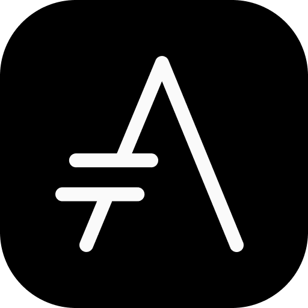

 

  

<h3 align="center"><i>Asciidoctor Jet</i></h3>
 

  A ready-to-use jet black themed template for building static sites using <a href="https://asciidoctor.org">Asciidoctor</a>.
   
   
  <a href="https://harshkapadia2.github.io/asciidoctor-jet"><b>Explore the docs »</b></a>
   
   
  <a href="https://harshkapadia2.github.io/asciidoctor-jet/#_features">Added Features</a>
  &nbsp;&nbsp;·&nbsp;&nbsp;
  <a href="https://harshkapadia2.github.io/asciidoctor-jet/#_live_demos">Live Demos</a>
  &nbsp;&nbsp;·&nbsp;&nbsp;
  <a href="https://harshkapadia2.github.io/asciidoctor-jet/#_getting_started">Getting Started</a>
   
   
  

 

### Changelogs

The changelog has been maintained in the [`CHANGELOG.md` file](CHANGELOG.md).

### Contributing

-   Contributors are welcome!
-   Please read the [`CONTRIBUTING.md` file](CONTRIBUTING.md) for contributing guidelines and the local setup guide.

### Code of Conduct

Please be mindful of the [Code of Conduct](CODE_OF_CONDUCT.md) while contributing and interacting.
